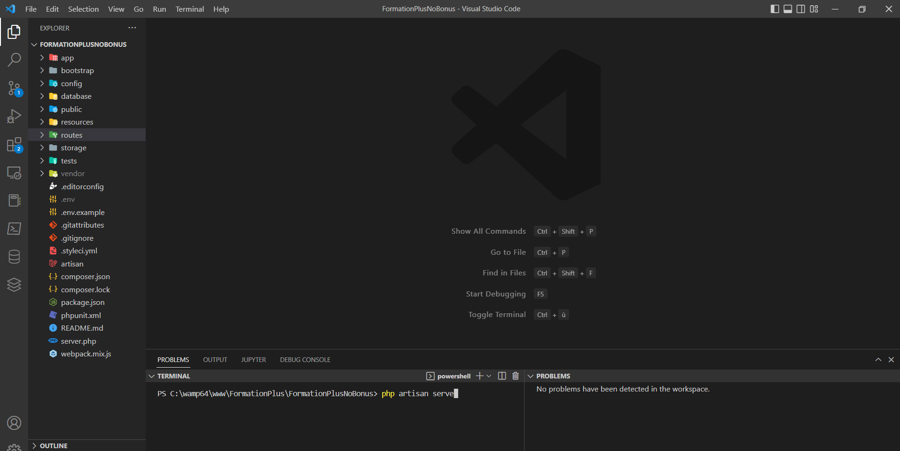
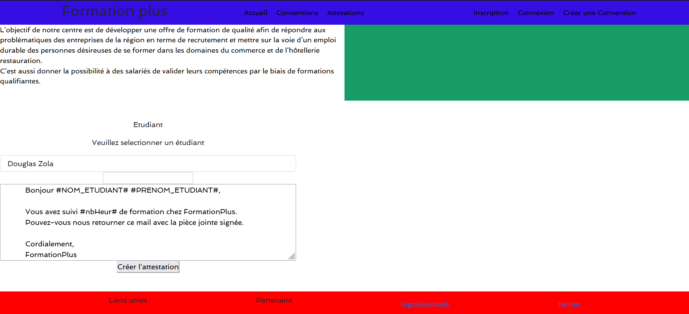
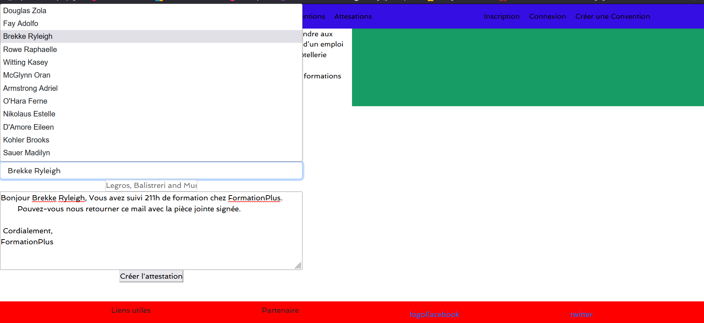
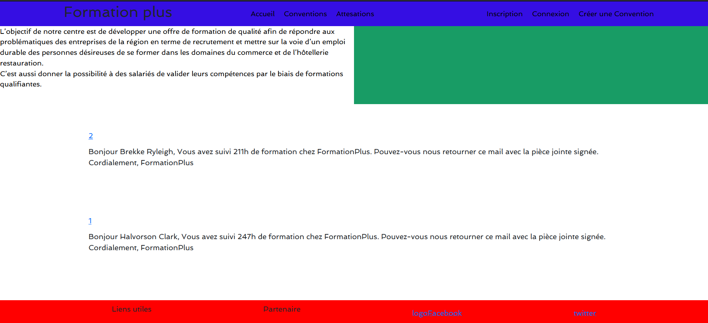

# Projet Formation_plus Rio CLEMENT

POC qui a pour objectif d'insérer une attestation en base de données pour un élève concernant une convention.

## Prérequis, installation, déploiement

Pour mon projet j'ai utiliser les logiciels suivants :

- un environnement windows 11
- wampserver 3.2.9 x64
- php 7.4.26
- composer 2.3.7
- Laravel 8.83.25
- mySQL 8.0.29
- apache 2.4.51

Après avoir cloner le repos, il vous faudra après être rentré dans le dossier FormationPlusNoBonus, lancer les commandes suivantes:

- composer install
- php artisan vendor:publish --tag=laravel-pagination  
  pour avoir une pagination des attesations.
- cp .env.example .env
- php artisan migrate (après avoir choisi une base de données ou crée la base de donnée Laravel du .env (ref=DB_DATABASE))
- php artisan key:generate
- php artisan serve
  Et vous avez accés au projet.

## Réalisation du projet

Pour la réalisation de ce POC; j'ai commencé par créer les bases de données demandées, leurs controllers et leurs modeles :

- php artisan make:model Convention -mcr
- php artisan make:model Etudiant -mcr
- php artisan make:model Attestation -mcr

J'y ai ensuite ajouté leur relations dans leurs migrations et leurs models respectivements, tout en ajoutant les colomnes qui était demandés.

Pour faciliter le travail et être plus efficace j'ai crée un seeder qui me crée 5 conventions et 25 étudiants, générant avec des données fictives des heures, des noms et des prénoms.
Cette fonctionnalités est gérée par les factories et les seeders que vous pouvez lancer avec :

- php artisan db:seed

Une fois que vous avez lancer le seeding à l'interieur du projet FormationPlusNoBonus, vous pouvez commencer à tester le projet.

Faites php artisan serve et vous pourrez selectionner un étudiant, et des générations automatiques du formulaire se feront.

Comme vous pouvez le voir les données se sont bel et bien stocké dans la base de donnée.

Pour toutes questions contacter via googlec chat par mon adresse mail clemen_r@etna-alternance.net .
